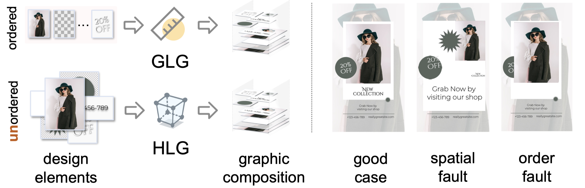
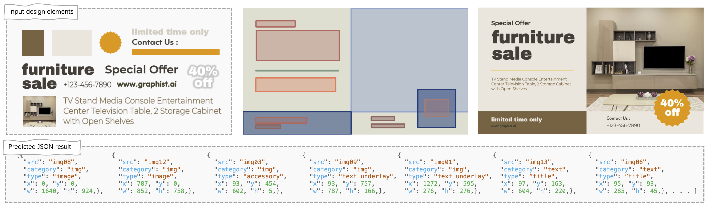
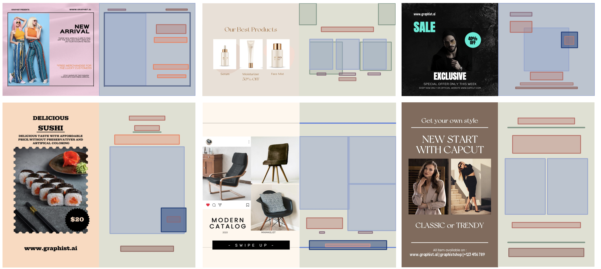
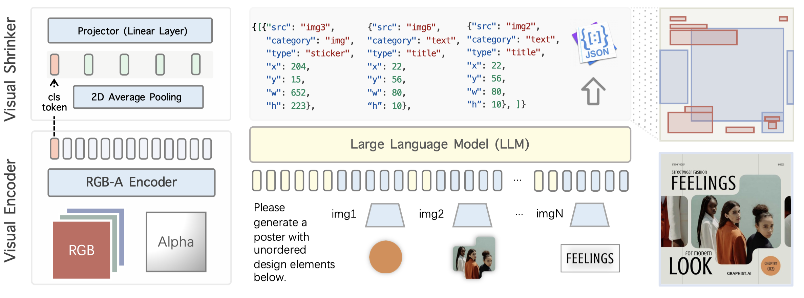

<!-- PROJECT LOGO -->
<br />
<p align="center">
  <a href="#">
</a>
  <h4 align="center">Graphic Design with Large Multimodal Model</h4>
    <p align="center">  
    Yutao Cheng<font color="magenta">*</font>  , <a href="https://zhaozhang.net/"> Zhao Zhang<font color="magenta">*</font> </a> , <a href="https://dblp.org/pid/210/5108.html">Maoke Yang</a><font color="magenta">*</font> 
    <br />
    Hui Nie, <a href="https://chunyuan.li/">Chunyuan Li</a>, Xinglong Wu, and Jie Shao
    <br />
    <a href="http://arxiv.org/abs/2404.14368"><strong> [arXiv 📚] </strong></a>
    <a href="#"><strong> [Layout Results 🖼️]</strong></a>
    <a href="#bib"><strong> [Bibtex 🔗] </strong></a>
    <br />
  </p>
</p>


***
**Graphist** is a design model based on Large Multimodal Model (LMM), designed for Hierarchical Layout Generation (**HLG**). Unlike traditional graphic layout generation (GLG) tasks that require a predefined sequence of layers, HLG generates graphic compositions from **unordered** sets of elements. The following figure illustrates the distinction between the two tasks. In HLG, the accuracy of layer ordering and spatial arrangement is crucial for the effectiveness of the final graphic composition.


<p align="center"> </p>

 The following poster are created by volunteers using our Graphist web demo. They can upload design elements, and Graphist will automatically generate a variety of graphic compositions.
<p align="center"> </p>
<p align="center"> </p>


Graphist effectively reinterprets HLG by treating it as a sequence generation problem. It accepts RGB-A images as input and produces a JSON draft protocol that specifies the coordinates, dimensions, and sequence of each design element. For an in-depth explanation, please consult our manuscript.


<p align="center"> </p>


## News
[2024/04/23]  Our manuscript is now available on <a href="http://arxiv.org/abs/2404.14368">arXiv</a>.

## To-Do List
- [ ] Release the Graphist checkpoint trained with the Crello dataset
- [ ] Publish layout results on the Crello dataset

## Cite
 <p id="bib">If you find this work beneficial, please cite it. We look forward to more researchers paying attention to the HLG task. </p>

```bibtex
@article{graphist2023hlg,
  title={Graphic Design with Large Multimodal Model},
  author={Cheng, Yutao and Zhang, Zhao and Yang, Maoke and Hui, Nie and Li, Chunyuan and Wu, Xinglong and Shao, Jie},
  journal={arXiv preprint arXiv:2404.14368},
  year={2024}
}
```
